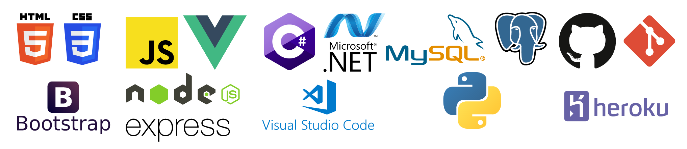

  
  

# Full-Stack Software Developer

# Profile

I am a software developer with a background in data analytics.  I previously worked for Vacasa where I optimized revenue streams by utilizing SQL and Python scripting.  I am passionate about utilizing software to create applications and solve problems. I have fully developed 2 Full-stack web applications and have contributed to 2 more as part of an agile development group. 

I enjoy quickly learning new skills and programming languages, backend and frontend frameworks,  design patterns like Model View Controller (MVC), and other methods of organizing code.  So far I have experience with JavaScript, HTML, CSS, C#, Python, Bootstrap, Git/Github, MySQL, PostgreSQL, and R.  I am enthusiastically looking into other programming languages, design frameworks, and principles that I can integrate into my existing knowledge in order to solve problems and build better software applications.

## Resume

[My Resume](./assets/Resume.pdf)

## Linkedin

[My LinkedIn Page](https://www.linkedin.com/in/benjamin-wiedeback/)

## About Me

[About Me (Video Link)](https://www.youtube.com/watch?v=C6EHGe_EhY8&feature=youtu.be)

## My Applications

- Keepr: An image forum application where posts can be created, saved by users into vaults, and accessed by other users. Utilizes a Vue.js front end with a C# back-end framework and a MySQL database.  
- Dcdr: A polling application that allows users to host polls with steam integration and allows other users to vote in those polls.  Utilizes a Vue.js front-end with a Node.js back-end and MongoDB.
- BugLog: A bug tracking application for small teams that utilizes a Vue.js front-end with a Node.js back-end.
- Game-Forum: A gaming forum where users can post and comment on other users’ posts. Built utilizing Javascript for the front end, a Node.js back-end, and MongoDB.

## Technologies

    

## Current Interests

I am currently in interested in learning more about javascript frameworks apart from VUE.js

I am also interested in learning more about unity development with C#.
